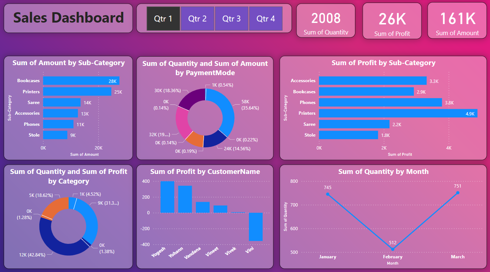

# Shop Sales Report PowerBi
This is a repository for visualization of sales in a shop by different categories.
# Power BI Project Objectives

1. **Sum of Quantity by Month:**
   - Analyze and visualize the total quantity of items sold each month.

2. **Sum of Profit by CustomerName:**
   - Examine and display the total profit generated for each customer.

3. **Sum of Quantity and Sum of Profit by Category:**
   - Explore the combined insights of total quantity and profit for each product category.

4. **Sum of Profit by Sub-Category:**
   - Break down the total profit into sub-categories to identify specific areas of profitability.

5. **Sum of Quantity and Sum of Amount by PaymentMode:**
   - Investigate the relationship between the total quantity of items sold and the overall transaction amount for each payment mode.

# some informtion about dataset to clear the objective

  
   

# Screenshots

    

 

# 
Please leave a star if you like it⭐️

